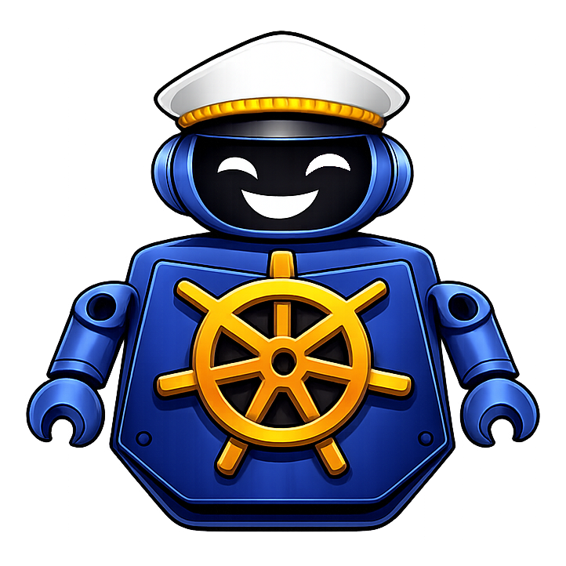

 
 

<h1>CruiseKube - Autopilot for Kubernetes</h1>

CruiseKube is an intelligent Kubernetes resource optimization controller that automatically monitors, analyzes, and applies resource recommendations to improve cluster efficiency and reduce costs.

# Content

- [Content](#content)
- [Introduction](#introduction)
  - [What is CruiseKube?](#what-is-cruisekube)
  - [When do you need CruiseKube?](#when-do-you-need-cruisekube)
- [Getting Started](#getting-started)
- [Configure CruiseKube](#configure-cruisekube)
- [Monitoring](#monitoring)
- [Development](#development)
- [Contribution](#contribution)
  - [Star History](#star-history)

# Introduction

## What is CruiseKube?

**CruiseKube** is a Kubernetes-native, continuous resource optimization system that autonomously right-sizes CPU and memory for workloads at **runtime** and **admission time**. It focuses on eliminating persistent over-provisioning while preserving workload reliability and scheduling constraints.

Unlike static requests, manual tuning, or reactive autoscaling, CruiseKube operates as a **closed-loop control system** that observes real workload behavior and incrementally converges resource requests toward optimal values.

## When do you need CruiseKube?

You would need CruiseKube if you are facing any of these issues -

- **Chronic over-provisioning** driven by guesswork, peak-based sizing, and fear of CPU throttling or OOM crashes
- **Cost inefficiency** that node-level bin packing as provided by autoscalers (Cluster Autoscaler/Karpenter) alone cannot fix
- **Operational Load** arising from manual tuning of workloads on kubernetes by developers or DevOps teams

CruiseKube explicitly addresses the **pod-level right-sizing problem**, in a fully hands-off manner.

# Getting Started

Details on how to install and configure CruiseKube can be found in the [Getting Started](./docs/src/getting-started.md) guide.

# Configure CruiseKube

Check out the different ways to configure CruiseKube in the [Configuration](./docs/src/configure-cruisekube.md) guide.

# Monitoring

Monitoring details can be found in the [Monitoring](./docs/src/arch-monitoring.md) guide.

# Development

Refer to [DEVELOPMENT.md](./DEVELOPMENT.md) for more details.

# Contribution

Contribution details can be found in the [Contribution](./CONTRIBUTING.md) guide.

<!-- # Getting Help

We have a dedicated [Discussions](https://github.com/truefoundry/CruiseKube/discussions) section for getting help and discussing ideas. -->

<!-- # Roadmap

We are maintaining the future roadmap using the [issues](https://github.com/truefoundry/CruiseKube/issues) and [milestones](https://github.com/truefoundry/CruiseKube/milestones). You can also suggest ideas and vote for them by adding a 👍 reaction to the issue. -->

## Star History

