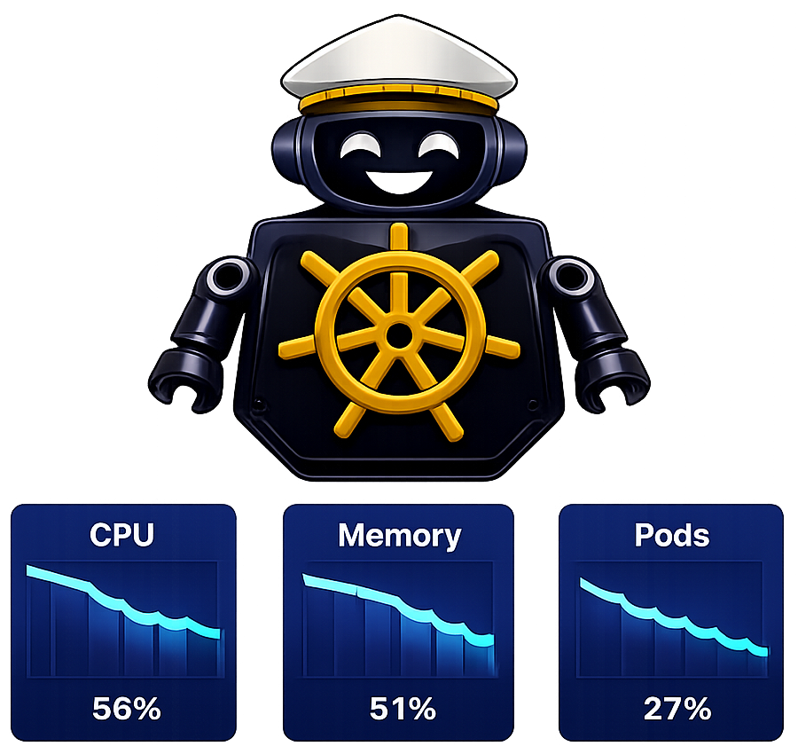

---
hide:
  - navigation
  - toc
---

<!-- Hero Section -->

  

    <h1 class="hero-title">CruiseKube</h1>
    
Intelligent Kubernetes Optimization

    

      Automatically monitor, analyze, and optimize your Kubernetes workloads for maximum efficiency and cost savings.
    

    

  <a href="/src/gs-installation/" class="cta-button md-button md-button--primary">Get Started</a>
      <a href="https://discord.gg/qFyN73htgE" class="md-button md-button--secondary" rel="noopener noreferrer">Join our community</a>
    

  

   

    
  

<!-- Features Section -->

  

    <h2>Why CruiseKube?</h2>
    
Streamline your Kubernetes operations with intelligent automation

  

  
  

    

      

        ⚙️
      

      <h3>Automated Optimization</h3>
      
Continuously monitors workload patterns and applies intelligent resource recommendations

    

    

      

        💰
      

      <h3>Cost Reduction</h3>
      
Reduce infrastructure costs by up to 40% through intelligent resource right-sizing

    

    

      

        🔒
      

      <h3>Safe Operations</h3>
      
Built-in safeguards and dry-run modes ensure your workloads remain stable

    

  

<!-- How It Works Section -->

  

    <h2>How It Works</h2>
    
Simple, automated optimization in four steps

  

  
  

    

      
01

      

        <h3>Monitor</h3>
        
Continuously collects metrics from Prometheus and analyzes workload patterns

      

    
 
    

      
02

      

        <h3>Recommend</h3>
        
Generates intelligent resource recommendations based on historical data

      

    
    
    

      
03

      

        <h3>Optimize</h3>
        
Safely applies recommendations with configurable automation levels

      

    

  

  

  

    <h2>Join Our Community</h2>
    
Get help, share your experience, and contribute to CruiseKube

  

  
  

    <a href="https://github.com/truefoundry/CruiseKube" >
    

      

        🐱
      

      <h3>GitHub</h3>
    

  </a>

  <a href="https://discord.gg/Dqek4xJa3N">
    

      

        💬
      

      <h3>Discord</h3>
    

  </a>

  <a href="https://github.com/truefoundry/CruiseKube/issues" >
    

      

        🐛
      

      <h3>Report Issues</h3>
    

  </a>

  

    

<!-- CTA Section -->

  

    <h2>Ready to optimize your Kubernetes cluster?</h2>
    
Start saving costs and improving performance today

    <a href="/src/gs-installation/" class="cta-button">Get Started Now</a>
  

