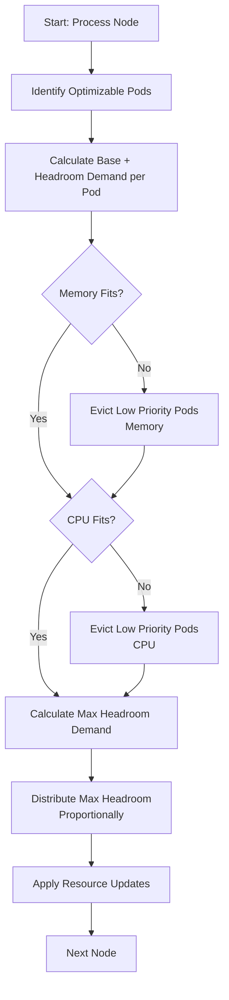

## Introduction

Resource optimization in Kubernetes can be broken down into two fundamental problems:

1. **Pod-level resource requests**: Correctly specifying resource requests for each pod to match actual usage patterns
2. **Bin-packing**: Efficiently scheduling multiple pods across nodes to maximize utilization

While node auto-provisioners like Karpenter and Cluster Autoscaler address the second problem, they often produce suboptimal results due to reliability constraints like topology spread constraints, affinity rules, and pod disruption budgets. CruiseKube focuses exclusively on the first problem **optimizing pod-level resource requests** since this is where most resource wastage occurs (industry-wide CPU and memory utilization of provisioned resources is typically very low).

## Problem Context

### Current State Challenges

The current approach to resource management in Kubernetes faces several fundamental challenges:

- **Reliability over cost**: Engineers tend to over-provision resources to avoid reliability issues, prioritizing stability over efficiency
- **Manual configuration**: Resource requests must be set manually for each workload, and changes require updating workload definitions (Deployments, StatefulSets, DaemonSets). This adds friction and complexity to resource optimization process.
- **Lopsided workload-level configuration**: Pods running on different nodes for the same workload may have different resource requirements. This is particularly bad for DaemonSets where pods on different nodes may have vastly different resource needs - a pod on a large node might need 10x more resources than one on a smaller node, yet all pods share the same resource specification
- **Peak provisioning**: CPU usage can spike up to 1000x baseline for workloads with sparse requests or job-like characteristics. Provisioning for these peaks leads to massive cumulative over-provisioning across the cluster

### What Changed

Two Kubernetes features enable a fundamentally different approach:

1. **[Kubernetes 1.33 - Pod-level resource updates](https://kubernetes.io/blog/2025/05/16/kubernetes-v1-33-in-place-pod-resize-beta/):**
    - Resources can now be updated at the pod level without recreating pods
    - Each pod can be optimized independently based on its actual usage patterns
    - Shorter prediction horizons become viable since decisions can be updated near real-time as new data arrives
    - Pods can be optimized considering the current node's conditions, allowing resource sharing between pods on the same node without sacrificing reliability

2. **[Kubernetes 1.34 - PSI (Pressure Stall Indicator) metrics](https://kubernetes.io/blog/2025/09/04/kubernetes-v1-34-introducing-psi-metrics-beta/):**
    - PSI metrics expose CPU and memory pressure at both node and container levels
    - CPU limits can be removed, replacing PSI metrics for CPU throttling signal for feedback on CPU contention
    - PSI-adjusted CPU usage provides accurate measurements of actual CPU demand under contention

### Design Philosophy

CruiseKube treats CPU and memory optimization differently:

- **CPU optimization**: Most over-provisioning comes from CPU over-provisioning. Better CPU request specification leads to overall better resource utilization when combined with node auto-provisioners. CPU usage can be extremely spiky, but in case of CPU contention, the workload is throttled rather than failed.

- **Memory optimization**: Memory usage tends to be consistent once allocated. Once a container uses a certain amount of memory, it typically remains at that level. However, containers hitting memory limits are immediately killed via OOM (Out-of-Memory), making memory under-provisioning far more dangerous than CPU under-provisioning.

## Core Concepts

### PSI (Pressure Stall Indicator)

PSI measures the time a task spends waiting for a resource (CPU, memory, or I/O). For CPU, PSI tracks how long processes wait for CPU time due to contention.

**PSI-Adjusted CPU Usage Formula:**

```
PSI_adjusted_usage = cpu_usage × (1 + psi_waiting_rate)
```

Where:

- `cpu_usage`: Raw CPU usage from `container_cpu_usage_seconds_total`
- `psi_waiting_rate`: Rate of CPU waiting time from `container_pressure_cpu_waiting_seconds_total`

**Example:**
If a container uses 0.5 CPU cores but experiences 20% CPU waiting time due to contention:
```
PSI_adjusted_usage = 0.5 × (1 + 0.2) = 0.6 CPU cores
```

This adjusted value reflects the actual CPU demand when the container is competing for resources, providing a more accurate basis for resource allocation decisions.

### Steady State vs Peak Usage

CruiseKube distinguishes between two usage patterns:

- **Steady State (P75)**: 
    - **CPU**: The 75th percentile of CPU usage over the last 10 minutes. This represents the current and typical, sustained usage. Thhis serves as the baseline demand. 
    - **Memory**: The 75th percentile of memory usage over the last 30 minutes. The longer window accounts for memory's higher reliability requirements compared to CPU.
- **Peak Usage (Max)**: The maximum value observed in the past 60 minutes at the current hour over the last 1 week. This methodology captures recurring patterns (e.g., daily cycles) while accounting for recent spikes. The difference between peak and steady state represents the `spike demand` or `headroom` needed to accommodate usage bursts.

## Algorithm Overview

CruiseKube uses a two-phase optimization approach:

- **Phase 1 (Admission Webhook)**: Sets initial resource requests at scheduling time to ensure the pod is scheduled on a node with sufficient capacity.

- **Phase 2 (Continuous Optimization)**: Periodically optimizes running pods, redistributing resources based on actual node conditions and sharing max headroom across pods.

## Phase 1: Admission Webhook Optimization

The admission webhook intercepts pod creation requests and sets resource requests based on historical usage patterns.

### When It Runs

- Triggered during pod creation (before scheduling)
- Mutates the pod specification before it reaches the scheduler

### Algorithm

```c
// Fetch historical statistics for this workload/container
stats = fetchWorkloadStats(pod.workloadIdentifier, container.name)

// Max = max observed in past 60 minutes at current hour over last 1 week
cpuPeakDemand = stats.CPUStats.Max
memoryPeakDemand = stats.MemoryStats.Max

// Set pod requests to accommodate peak usage
pod.spec.containers[container].resources.requests.cpu = cpuPeakDemand
pod.spec.containers[container].resources.requests.memory = memoryPeakDemand

// Set memory limit to 2 × max memory over last 7 days (safety buffer)
memoryLimit = 2 × max(stats.Memory7Day.Max)
pod.spec.containers[container].resources.limits.memory = memoryLimit

// Note: CPU limits are not set (relying on PSI metrics for feedback)
pod.Spec.containers[container].Resources.Limits.CPU = nil
```

### Purpose

- **Prevents repeated evictions**: By setting requests to peak usage, the pod is guaranteed to fit on the node where it's scheduled even after continuous optimization has run.
- **Provides initial optimization**: Even without continuous optimization, pods start with better resource allocation

## Phase 2: Continuous Optimization

The continuous optimization controller runs periodically, optimizing resources for pods already running on nodes.

### When It Runs

- Periodic reconciliation loop (configurable schedule)
- Processes one node at a time
- Updates pod resources in-place without pod recreation

### Algorithm Flow



### Detailed Algorithm

```c
FOR EACH node IN cluster:

  // Step 1: Identify scope of optimization
  optimizablePods = selectPodsEligibleForOptimization(node.pods)
  nonOptimizablePods = node.pods - optimizablePods
  
  availableCPU = node.allocatable.cpu - sum(nonOptimizablePods.cpuRequests)
  availableMemory = node.allocatable.memory - sum(nonOptimizablePods.memoryRequests)

  // Step 2: Compute baseline demand and headroom demand per pod
  FOR EACH pod IN optimizablePods:
    FOR EACH container IN pod.containers:
      // CPU base demand: P75 over last 10 minutes
      stats = fetchWorkloadStats(pod.workloadIdentifier, container.name)
      container.CPUBaseDemand = stats.CPUStats.P75
      
      // CPU headroom demand: Max - Base
      container.CPUHeadroomDemand = stats.CPUStats.Max - container.CPUBaseDemand
      
      // Memory base demand: P75 over last 30 minutes
      container.MemoryBaseDemand = stats.MemoryStats.P75  // P75 over last 30 min
      
      // Memory headroom demand: Max - Base
      container.MemoryHeadroomDemand = stats.MemoryStats.Max - container.MemoryBaseDemand
      
    pod.evictionRanking = determineEvictionRanking(pod)
    pod.totalRecommendedCPU = sum(container.CPUBaseDemand)
    pod.totalRecommendedMemory = sum(container.MemoryBaseDemand)
    pod.maxHeadroomCPU = max(container.CPUHeadroomDemand)
    pod.maxHeadroomMemory = max(container.MemoryHeadroomDemand)

  // Step 3: Evict pods if memory doesn't fit
  sort pods by: DaemonSet > evictionRanking > maxHeadroomMemory (descending)
  WHILE sum(pod.totalRecommendedMemory) + max(pod.maxHeadroomMemory) > availableMemory:
    podToEvict = pods[0]  // Lowest priority
    markForEviction(podToEvict)
    remove podToEvict from pods

  // Step 4: Evict pods if CPU doesn't fit
  sort pods by: DaemonSet > evictionRanking > maxHeadroomCPU (descending)
  WHILE sum(pod.totalRecommendedCPU) + max(pod.maxHeadroomCPU) > availableCPU:
    podToEvict = pods[0]  // Lowest priority
    markForEviction(podToEvict)
    remove podToEvict from pods

  // Step 5: Distribute spike headroom across surviving pods
  maxHeadroomCPU = max(pod.maxHeadroomCPU for pod IN pods)
  maxHeadroomMemory = max(pod.maxHeadroomMemory for pod IN pods)
  totalHeadroomCPU = sum(container.CPUHeadroomDemand for all containers in pods)
  totalHeadroomMemory = sum(container.MemoryHeadroomDemand for all containers in pods)

  FOR EACH pod IN pods:
    FOR EACH container IN pod.containers:
      // Proportional distribution based on each container's spike demand
      cpuRatio = container.CPUHeadroomDemand / totalHeadroomCPU
      additionalCPU = maxHeadroomCPU × cpuRatio
      
      memoryRatio = container.MemoryHeadroomDemand / totalHeadroomMemory
      additionalMemory = maxHeadroomMemory × memoryRatio
      
      container.finalCPU = container.CPUBaseDemand + additionalCPU
      container.finalMemory = container.MemoryBaseDemand + additionalMemory

  // Step 6: Apply recommendations at runtime
  FOR EACH pod IN pods:
    FOR EACH container IN pod.containers:
      // Apply CPU request (no CPU limit set)
      applyCPURequest(pod, container, container.finalCPU)
      
      // Apply memory request and limit
      // Limit = 2 × max(memory over last 7 days, OOM memory)
      memoryLimit = 2 × max(container.stats.Memory7Day.Max)
      applyMemoryRequestAndLimit(pod, container, container.finalMemory, memoryLimit)

END
```

### Key Differences from Admission Webhook

- **Resource sharing**: Headroom is distributed proportionally rather than allocated fully to each pod
- **Node-aware**: Considers actual node capacity and current pod placement
- **Eviction support**: Can evict pods to make room for better optimization
- **Incremental updates**: Resources are updated in-place without pod recreation

## Key Mechanisms

### Headroom Demand Distribution

Rather than provisioning each pod for its maximum spike, CruiseKube distributes spike headroom across pods on a node. This is done with the following rationale:

1. Not all pods on a node spike simultaneously
2. The maximum headroom demand across all pods on a node represents the short lived and worst-case scenario for the node

This `headroom` (i.e. peak usage - steady state) is shared proportionally, reducing total resource requirements for the node

### Eviction Priority

When a node cannot accommodate all pods, CruiseKube uses a priority-based eviction system to make space:

1. **DaemonSets**: Always protected from eviction (they must run on every node)
2. **Eviction Ranking**: Configurable per-workload priority that determines eviction order:
    - **Low**: Low priority workloads are evicted first. This is the priority for most workloads by default
    - **Medium**: Medium priority workloads are evicted next. Single replica or statefulset workloads are set to this value by default
    - **High**: High priority workloads are evicted as a last resort
    - **No-Eviction**: No-eviction workloads are never evicted at all
3. **Tie-breaker**: Among pods with the same eviction ranking, those with higher headroom demand (`peak_usage - base_demand`) are evicted first, to minimise the number of evictions needed

### Memory Limit Calculation

Memory limits are set independently from memory requests to provide a safety buffer:

- **Memory Limit Formula**: `2 × (maxMemoryUsage7Days, limitMemoryAtOOMKill)`
  - `maxMemoryUsage7Days`: Maximum memory usage observed over the last 7 days
  - `limitMemoryAtOOMKill`: Memory limit at the time of OOM kill events (if any)
- **Purpose**: Prevents OOM kills by providing headroom above the optimized request value
- **Rationale**: Memory requests can be optimized aggressively (down to P75 + distributed spike), while limits ensure containers have sufficient headroom to handle unexpected memory growth

### Why CPU Limits Aren't Needed

CruiseKube does not set CPU limits, only CPU requests. This differs from memory, where both requests and limits are configured.

**Traditional CPU limits serve two purposes**:

1. **Resource isolation**: Prevent one pod from consuming all CPU
2. **Throttling feedback**: Indicate when a pod needs more CPU

**With PSI metrics**:

- **PSI provides throttling feedback**: High PSI values indicate CPU contention without needing limits
- **Requests provide isolation**: CPU requests ensure fair scheduling and resource allocation
- **Better observability**: PSI metrics provide more granular insight into contention than throttling metrics

**Contrast with Memory**:

By removing CPU limits and using PSI-adjusted usage for requests, CruiseKube:

- Eliminates unnecessary CPU throttling
- Provides more accurate CPU resource allocation
- Maintains reliability through PSI-based feedback
- Allows CPU to burst when available, improving overall utilization

## Safety & Reliability Related Mechanisms

### Node Load Monitoring

To mitigate scenarios where multiple pods spike simultaneously, CruiseKube monitors node load:

- **Load Calculation**: `node_load1 / node_cpu_capacity`
- **Threshold**: When load exceeds 100% (1.0), the node is considered overloaded
- **Action**: Node is cordoned (tainted with `NoSchedule`) to prevent new pod scheduling
- **Recovery**: Taint is removed when load drops below threshold

During overload:

- PSI metrics increase, causing future resource requests to be higher
- No new pods are scheduled on the overloaded node to prevent further resource contention

### Preventing Repeated Evictions

The admission webhook ensures pods are scheduled with requests equal to their peak usage. This guarantees:

- The node has sufficient capacity at scheduling time
- Subsequent continuous optimization runs only evict pods whose spikes cannot be accommodated
- Once evicted, a pod will be rescheduled with peak requests, preventing immediate re-eviction

### High-Priority Workload Protection

- Single-replica workloads and StatefulSets default to medium eviction ranking
- Most workloads default to low eviction ranking
- Users can configure eviction ranking per workload via overrides
- DaemonSets are never evicted
- Workloads with no-eviction ranking are never evicted

### Contention Mitigation

- **Node cordoning**: Overloaded nodes are isolated to prevent further scheduling
- **PSI feedback**: High PSI values increase resource requests for future optimizations
- **Proportional distribution**: Headroom is shared, reducing the likelihood of simultaneous spikes exhausting resources

## References

- [Kubernetes 1.33 - Pod-level resource updates](https://kubernetes.io/blog/2025/05/16/kubernetes-v1-33-in-place-pod-resize-beta/)
- [Kubernetes 1.34 - PSI (Pressure Stall Indicator) metrics](https://kubernetes.io/blog/2025/09/04/kubernetes-v1-34-introducing-psi-metrics-beta/)
- [PSI Documentation](https://facebookmicrosites.github.io/psi/)