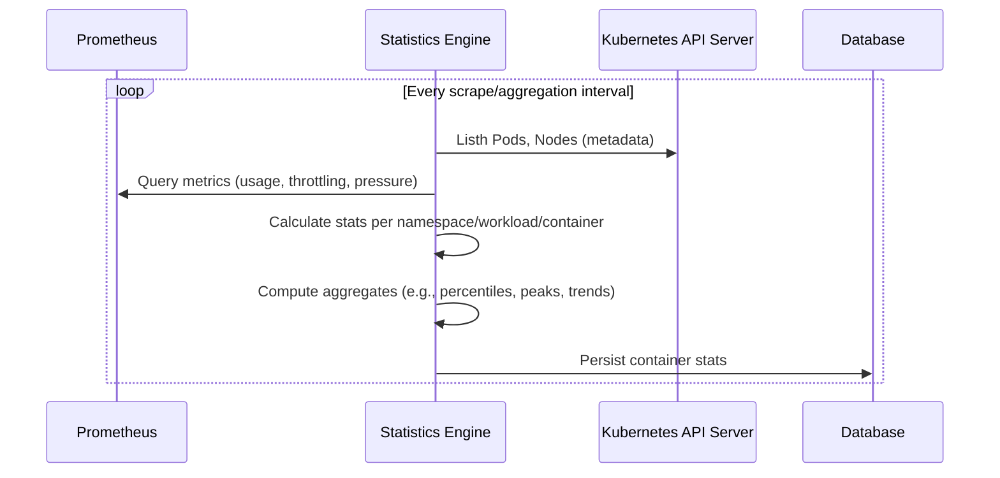
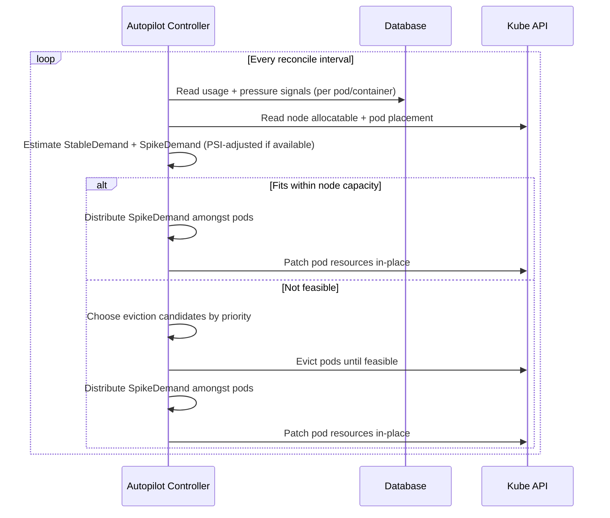
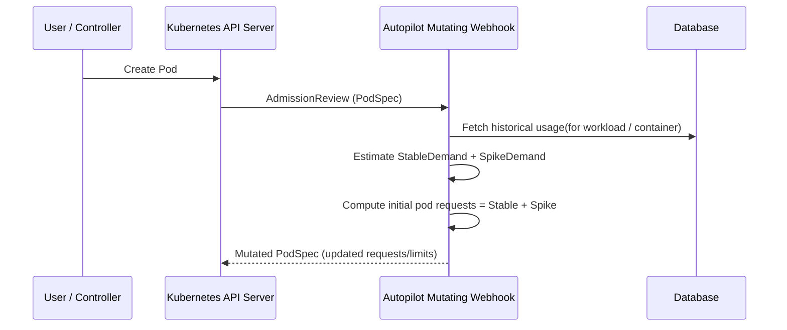

# Overview

By default, the **CruiseKube Helm chart** deploys:

- **Controller**
  - Telemetry Engine
  - Runtime Optimizer
- **Webhook**
  - Admission Optimizer
- **Frontend**
  - Observable interface for recommendations
  - Setting User configurations per workload
  - Potential savings once CruiseKube is enabled in Cruise mode
- **Database**:
  - Stores the statistics generated by the Statistics Engine
  - Stores the user configurations per workload

# Core Components

Conceptually, CruiseKube is composed of three tightly-coupled components:

### Statistics Engine

- Continuously evaluates CPU and memory usage for each workload
- Track instances of high CPU load and memory OOMs
- Derives stable statistics (percentiles, headroom, variability)
- Persists computed metrics in an internal datastore
- Built on **Prometheus** as the primary metrics source

### Runtime Optimizer

- Implemented as a reconciliation loop in `cruisekube-controller`
- Iteratively optimizes **running workloads**, one node at a time
- Keeps the priority of individual workloads into account to minimise disruption

### Admission Optimizer

- Implemented as a **mutating admission webhook**
- Intercepts new pod creations
- Rewrites resource requests using learned recommendations

## Control Flows

### Statistics Engine

1. Connects to target cluster prometheus and cluster
2. Calculates stats related to CPU usage, CPU pressure, memory usage, OOM instances etc
3. Stores the calculated telemetry into database

### **Runtime Optimizer Flow**

1. Connect to target cluster to iterate over nodes
2. Fetch workload statistics from DB
3. Adjusts resources in-place for pods on the node

### **Admission Optimizer Flow**

1. Intercept pod spec
2. Fetch statistics from the controller
3. Mutate requests before scheduling