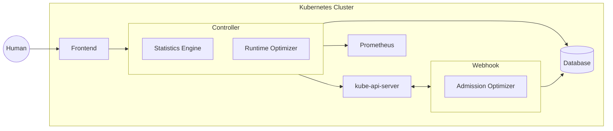
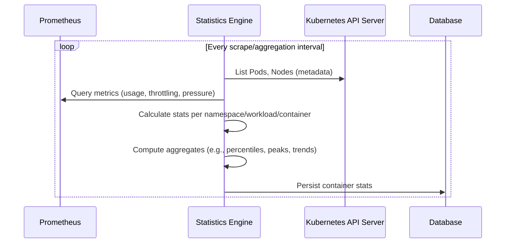
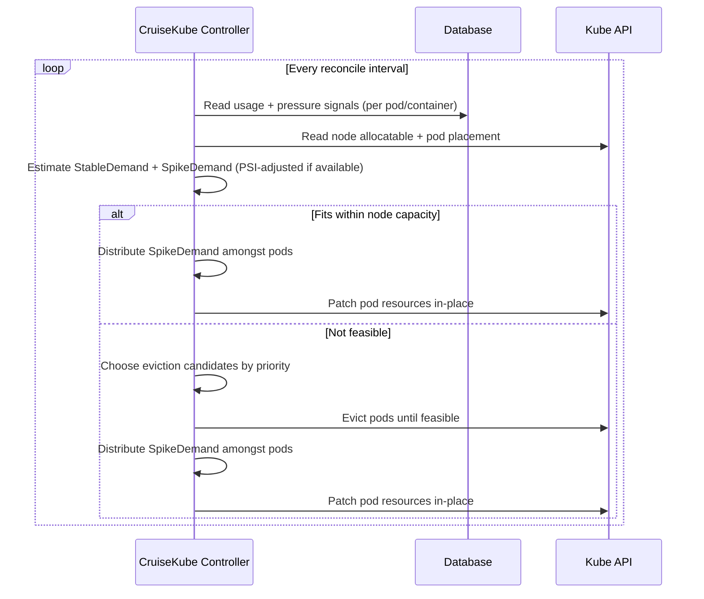
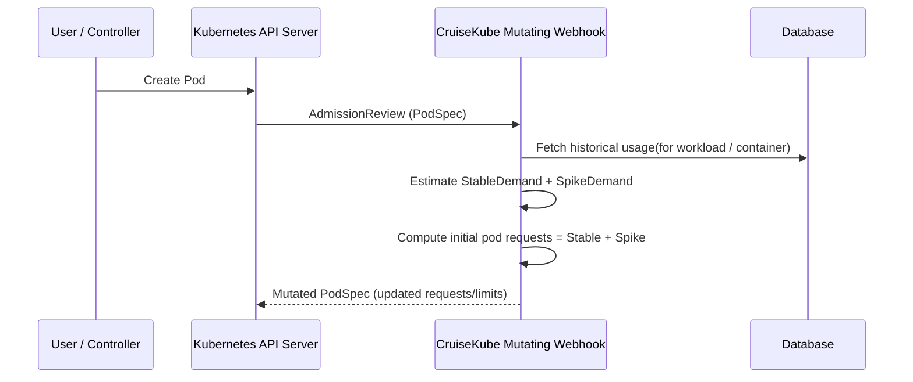

## Overview

CruiseKube operates as a closed-loop system through a set of **periodic background tasks**.
Each task has a clearly defined responsibility and can be enabled or disabled independently.

1. **Create Stats Task:**
Builds persistent, workload-level CPU and memory statistics from Kubernetes state and Prometheus metrics. These stats form the foundation for all optimization decisions and are stored for reuse.
2. **Apply Recommendation Task:**
Generates and applies CPU and memory recommendations to workloads in a controlled, incremental manner. This is the core task responsible for actually right-sizing workloads.
3. **Fetch Metrics Task:**
Fetches metrics from the cluster and exposes them as prometheus metrics.
4. **Node Load Monitoring Task:**
Monitors the CPU load on nodes and isolates nodes that are overloaded.

Together, these tasks allow CruiseKube to continuously optimize resources **without relying on manual tuning or reactive scaling**.

## Components

The high-level architecture consists of 4 components deployed using the **CruiseKube Helm chart**:

- **Controller**
    - Statistics Engine - Collects metrics from the cluster and stores them in the database
    - Runtime Optimizer - Optimizes the resources of the running workloads on the cluster
- **Webhook**
    - Admission Optimizer - Intercepts new pod creations and optimizes the resources of the pod before it is scheduled
- **Frontend**
    - Observable interface for recommendations - The frontend provides a user-friendly interface to view the recommendations and the potential savings
    - Setting User configurations per workload - The frontend allows the user to set the user configurations like priority, mode, etc. per workload
    - Potential savings once CruiseKube is enabled in Cruise mode - The frontend shows the potential savings once CruiseKube is enabled in Cruise mode
- **Database**:
    - Stores the statistics generated by the Statistics Engine - The database stores the statistics generated by the Statistics Engine
    - Stores the user configurations per workload - The database stores the user configurations like priority, mode, etc. per workload

### Statistics Engine

- Continuously evaluates CPU and memory usage for each workload
- Track instances of high CPU load and memory OOMs
- Derives stable statistics (percentiles, headroom, variability)
- Persists computed metrics in an internal datastore
- Built on **Prometheus** as the primary metrics source

### Runtime Optimizer

- Implemented as a reconciliation loop in `cruisekube-controller`
- Iteratively optimizes **running workloads**, one node at a time
- Keeps the priority of individual workloads into account to minimise disruption

### Admission Optimizer

- Implemented as a **mutating admission webhook**
- Intercepts new pod creations
- Rewrites resource requests using learned recommendations

## Control Flows

### Statistics Engine

1. Connects to target cluster prometheus and cluster
2. Calculates stats related to CPU usage, CPU pressure, memory usage, OOM instances etc.
3. Stores the calculated statistics into database

### **Runtime Optimizer Flow**

1. Connect to target cluster to iterate over nodes
2. Fetch workload statistics from DB
3. Adjusts resources in-place for pods on the node

### **Admission Optimizer Flow**

1. Intercept pod spec
2. Fetch statistics from the controller
3. Mutate requests before scheduling

## Next Steps

- Get started with installation [here](./gs-installation.md)
