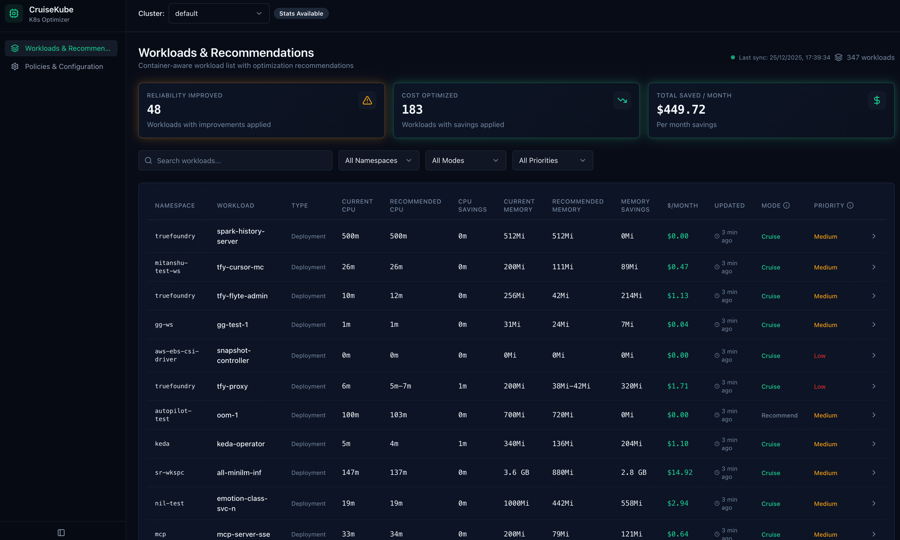
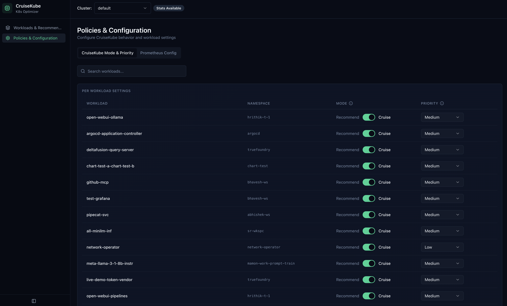
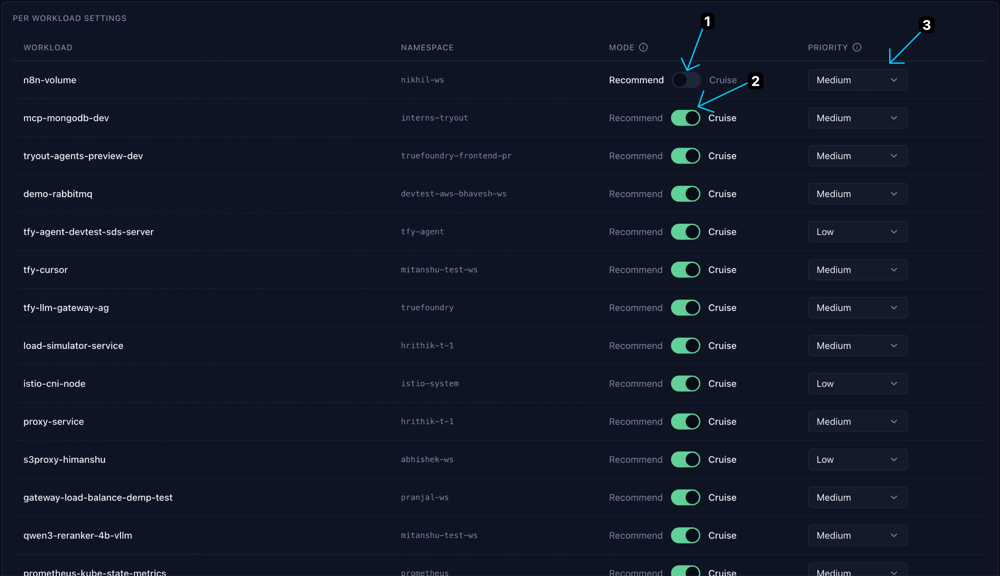

# Configuration Dashboard

The CruiseKube dashboard provides a web interface for monitoring and managing your resource optimization settings.

## Accessing the Dashboard

The dashboard is exposed as a Kubernetes Service and can be accessed in several ways:

### **Using kubectl port-forward**
```bash
kubectl port-forward -n cruisekube-system svc/cruisekube-frontend 3000:3000
```

### **Using ingress (if configured)**
If you have configured an ingress controller and exposed the dashboard via ingress, you can access it using the configured domain.

## Workload & Recommendation

You can view the recommendations and manage workloads through the dashboard. This tells you the current status, optimization suggestions and cost saved for your workloads.



</br>

## Policies & Configuration

You can configure optimization policies and settings for your workloads through the dashboard.



## Configure Options For Workloads

1. **Recomment Mode** (Disabled): No optimization is applied to the workload.
2. **Cruise Mode** (Enabled): CruiseKube applies optimization to the workload based on the configured policies.
3. **Priority**: We use a notion of per-workload priority to make sure the lower priority workloads are evicted first if possible. Workloads with single replica or part of a statefulset are kept at a higher priority by default.
      - **Low**: Low priority workloads are evicted first. This is the priority for most workloads by default
      - **Medium**: Medium priority workloads are evicted next. Single replica or statefulset workloads are set to this value by default
      - **High**: High priority workloads are evicted as a last resort
      - **No-Eviction**: No-eviction workloads are never evicted at all


