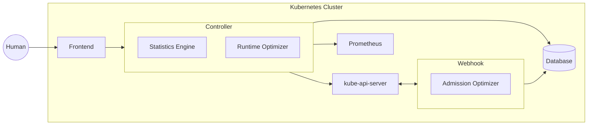

# Introduction

## What is CruiseKube?

**CruiseKube** is a Kubernetes-native, continuous resource optimization system that autonomously right-sizes CPU and memory for workloads at **runtime** and **admission time**. It focuses on eliminating persistent over-provisioning while preserving workload reliability and scheduling constraints.

Unlike static requests, manual tuning, or reactive autoscaling, CruiseKube operates as a **closed-loop control system** that observes real workload behavior and incrementally converges resource requests toward optimal values.

## When do you need CruiseKube?

You would need CruiseKube if you are facing any of these issues -

- **Chronic over-provisioning** driven by guesswork, peak-based sizing, and fear of CPU throttling or OOM crashes
- **Cost inefficiency** that node-level bin packing as provided by autoscalers (Cluster Autoscaler/Karpenter) alone cannot fix
- **Operational Load** arising from manual tuning of workloads on kubernetes by developers or DevOps teams

CruiseKube explicitly addresses the **pod-level right-sizing problem**, in a fully hands-off manner.

## Architecture

Read more about the architecture in the [Architecture](arch-overview.md) section.
